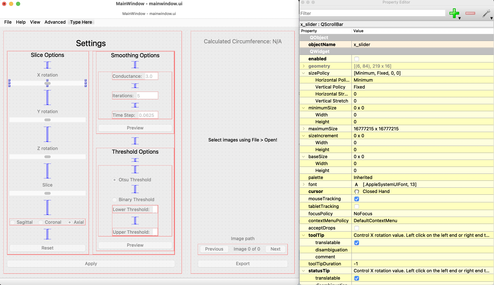

.. _libraries:

#########
Libraries
#########

.. topic:: Overview

    This page describes what the libraries we use are for and how to use them.

.. contents::
    :depth: 3

.. _SimpleITK:

SimpleITK (:code:`sitk`)
########################

For image processing.

.. _SimpleITKIO:

I/O, 3D rotation, and slicing
=============================

.. code-block:: python
    :linenos:

    import SimpleITK as sitk
    import numpy as np
    from pathlib import Path

    # Read in a file
    reader: sitk.ImageFileReader = sitk.ImageFileReader()
    reader.SetFileName(str(Path('some') / 'path' / 'to' / '3D image'))
    mri_3d: sitk.Image = reader.Execute()

    # Get its dimensions
    dimensions: tuple = mri_3d.GetSize()

    # 3D rotation setup
    theta_x, theta_y, theta_z = 30, 45, 90
    euler_3d_transform: sitk.Euler3DTransform = sitk.Euler3DTransform()
    euler_3d_transform.SetCenter(mri_3d.TransformContinuousIndexToPhysicalPoint(
                [((dimension - 1) / 2.0) for dimension in dimensions]))
    euler_3d_transform.SetRotation(theta_x, theta_y, theta_z)

    # 3D rotate
    rotated_3d: sitk.Image = sitk.Resample(mri_3d, euler_3d_transform)

    # 2D slice
    slice_z = 50
    rotated_slice: sitk.Image = rotated_3d[:, :, slice_z]

    # Convert to numpy array
    # NOTE: GetArrayFromImage returns the transpose of the sitk representation!
    slice_np: np.ndarray = sitk.GetArrayFromImage(rotated_slice)

.. warning:: :code:`sitk.GetArrayFromImage()` returns the transpose of the :code:`sitk` representation!

Code involving :code:`sitk` is scattered throughout our project. Here's a specific example:

.. seealso::

    .. currentmodule:: src.utils.img_helpers
    .. autofunction:: get_curr_rotated_slice

.. _SimpleITKFiltering:

Filtering
=========

.. seealso::

    .. currentmodule:: src.utils.imgproc
    .. autofunction:: contour

.. _SimpleITKFileFormats:

File formats supported
======================

`<https://simpleitk.readthedocs.io/en/master/IO.html>`_

You probably won't have to worry about this since all common image formats are supported, and
:code:`sitk.ImageFileReader` automatically detects the file extension, so you don't have to handle it.

.. _SimpleITKFiji:

Fiji & tutorial notebooks
=========================

Not in use anymore.

See `<https://simpleitk.org/TUTORIAL>`_ for setup instructions (installing the external image viewer Fiji
used in some of our old :code:`.ipynb` files) and a bunch of tutorial Jupyter notebook files, most of which
are too advanced for this project. What's already in `src/ <src.html>`_ should suffice for this project.

.. _SimpleITKResources:

Resources
=========

`<https://simpleitk.readthedocs.io/en/master/>`_

.. _numpy:

numpy (:code:`np`)
##################

For image processing and arc length calculation.

In the :ref:`SimpleITK` section, we converted the :code:`sitk` representation to a :code:`np`
array.

From here, we do two things: :ref:`PyQt6ImageVisualization` and :ref:`arc length computation <opencv>`.

.. _opencv:

opencv
######

For arc length calculation from a :code:`np` array representing a binary contour.

First, read through `Contours: Getting Started <https://docs.opencv.org/4.x/d4/d73/tutorial_py_contours_begin.html>`_ (easy to understand)
and `findContours <https://docs.opencv.org/4.x/d3/dc0/group__imgproc__shape.html#gadf1ad6a0b82947fa1fe3c3d497f260e0>`_ (full documentation).

.. seealso::

    .. currentmodule:: src.utils.imgproc
    .. autofunction:: length_of_contour

.. _PyQt6:

PyQt6
#####

For GUI. Serves the purpose of View and Controller. Drag-and-drop GUI design using :ref:`PyQt6QtDesigner`.
Easy styling with :code:`.qss` stylesheets and resource (icon) management with :code:`.qrc` files, both of
which are even more easily managed using :ref:`BreezeStyleSheets`.

According to Eric, it's pronounced "pie-cute" (we all say "pie-cue-tee" though).

.. _PyQt6QtDesigner:

QtDesigner
==========

For drag-and-drop GUI design. Generates :code:`.ui` files (pretty much XML)
that are then loaded into Python code.

`Install it <https://build-system.fman.io/qt-designer-download>`_. In QtDesigner, open
`mainwindow.ui <https://github.com/COMP523TeamD/HeadCircumferenceTool/blob/main/src/GUI/mainwindow.ui>`_.
You'll get the idea.

.. _PyQt6Controller:

Controller stuff
================

There isn't a Controller class. Controller stuff is done in `src/GUI/main.py <_modules/src/GUI/main>`_.

QtDesigner lets you assign names to elements. Then these variables are accessible from code.

.. seealso:: How to connect GUI events (signals) to functions

    .. currentmodule:: src.GUI.main.MainWindow
    .. autofunction:: __init__

    `[source] <_modules/src/GUI/main.html#MainWindow>`_

    .. note::

        Use :code:`lambda` functions to pass arguments.

.. seealso:: How to get and set values in the GUI

    .. currentmodule:: src.GUI.main.MainWindow
    .. autofunction:: rotate_x

    `[source] <_modules/src/GUI/main.html#MainWindow.rotate_x>`_

.. _PyQt6Layout:

Layout
======

Laying out elements in horizontal and vertical layouts allows the GUI elements to
resize themselves when the user resizes the window.

If you're making a new window,
right click outside any element in QtDesigner and click Layout.
This will allow you to lay out all elements.

.. _PyQt6ImageVisualization:

Image visualization
===================

.. seealso::

    .. currentmodule:: src.GUI.main.MainWindow
    .. autofunction:: render_curr_slice

    `[source] <_modules/src/GUI/main.html#MainWindow.render_curr_slice>`_

.. _PyQt6QRC:

QRC file
========

Used to manage resources (application icons in :code:`.svg`, :code:`.png`, etc. formats).

See this short `YouTube video <https://www.youtube.com/watch?v=LG4QgG9AZkE>`_ about QRC files.

:ref:`BreezeStyleSheets` generates QRC files and compiled Python resource files that we can use. That section of
this page is very closely related. Read that next if you're working on styling the GUI.

.. seealso:: How to access a resource

    .. currentmodule:: src.GUI.helpers.ErrorMessageBox
    .. autofunction:: __init__

    `[source] <_modules/src/GUI/helpers.html#ErrorMessageBox>`_

There's also `PyQt documentation <https://doc.qt.io/qtforpython/tutorials/basictutorial/qrcfiles.html#changes-in-the-code>`_
about how to access resources once imported.

.. _PyQt6Resources:

Resources
=========

`YouTube playlist <https://www.youtube.com/watch?v=Vde5SH8e1OQ&list=PLzMcBGfZo4-lB8MZfHPLTEHO9zJDDLpYj>`_

* He exports Python code from :ref:`PyQt6QtDesigner` and edits the raw Python code, which I think is a terrible approach. It's better to load the :code:`.ui` files from within Python. But the videos are otherwise great.

`Qt for Python <https://doc.qt.io/qtforpython-6/>`_

* This link is "qtforpython-6". It references :code:`PySide6`, but mostly everything is the same, as mentioned below. If you Google a keyword, you might get a result on the "qtforpython-5" site. There are some small (mostly naming) differences, so make sure you're on the the correct site.

.. _PyQt6Alternatives:

Alternatives
============

`No major differences <https://www.pythonguis.com/faq/pyqt5-vs-pyqt6/#:~:text=As%20we've%20discovered%2C%20there,d%20suggest%20starting%20with%20PyQt6>`_ between PyQt5 and PyQt6.

`Also no major differences <https://www.pythonguis.com/faq/pyqt6-vs-pyside6/>`_ between PySide6 and PyQt6.
PySide6 is more official than PyQt6, and official documentation always references PySide6.

Mostly everything in PySide6 and PyQt6 is exactly the same, but there are some annoying differences.

* When we had multiple windows, switching to PySide6 broke window switching, and I couldn't figure it out.
* There are minor naming differences, such as QImage.Format.Format_Grayscale16 (PyQt6) vs. QImage.Format_Grayscale16 (PySide6).
* Loading a :code:`.ui` file is `different <https://github.com/COMP523TeamD/HeadCircumferenceTool/pull/26>`_.

.. warning:: Note QImage and :ref:`numpy` treat width and height differently!

    :ref:`qimage2ndarray` helps us avoid this problem, but just FYI.

    .. code-block:: python
        :linenos:

        import numpy as np
        from PyQt6.QtGui import QPixmap, QImage
        from PyQt6.QtWidgets import QMainWindow

        class MainWindow(QMainWindow):
            def __init__(self):
                pass

            def test(self):
                slice_np: np.ndarray = np.array([[65535, 0, 0, 0],
                                                 [0, 0, 0, 65535]], dtype='uint16')
                # Note reversed ordering
                q_img: QImage = QImage(slice_np.data, slice_np.shape[1], slice_np.shape[0],
                                      QImage.Format.Format_Grayscale16)
                self.image.setPixmap(QPixmap(q_img))

            # Rest of the code omitted

    .. image:: _static/qimage_numpy.jpg
        :width: 300px
        :align: center
        :alt: Reversed width and height between QImage and numpy

.. _qimage2ndarray:

qimage2ndarray
##############

For :ref:`PyQt6ImageVisualization` in PyQt GUI.

Specifically, qimage2ndarray converts a :code:`np` array to a :code:`QImage` that can be displayed in a PyQt GUI,
as the name implies. This circumvents difficulties [#npqimage]_ with converting :code:`np` array to :code:`QImage`.

`GitHub <https://github.com/hmeine/qimage2ndarray>`_ and `Documentation <http://hmeine.github.io/qimage2ndarray/>`_ (very brief).

.. seealso::

    .. currentmodule:: src.GUI.main.MainWindow
    .. autofunction:: render_curr_slice

    `[source] <_modules/src/GUI/main.html#MainWindow.render_curr_slice>`_

.. warning:: In :code:`src/GUI/main.py`, if :code:`import qimage2ndarray` goes before the PyQt imports (which an
    autoformatter might do), there will be a :code:`ModuleNotFoundError`.

.. _BreezeStyleSheets:

BreezeStyleSheets
#################

Used to generate our GUI's :code:`.qss` stylesheets and corresponding :code:`resources.py` files.

We have a custom `fork <https://github.com/COMP523TeamD/BreezeStyleSheets>`_ with a script
(`hct.py <https://github.com/COMP523TeamD/BreezeStyleSheets/blob/main/hct.py>`_) that automates the process.

.. _BreezeStyleSheetsHowItWorks:

How it works
============

Read the brief README in our `BSS fork <https://github.com/COMP523TeamD/BreezeStyleSheets>`_.

Then see the `hct.py <https://github.com/COMP523TeamD/BreezeStyleSheets/blob/main/hct.py>`_
script, which automates everything below.

In a nutshell, we edit a JSON file with hex color codes (the JSON controls only the colors of elements)
and compile the JSON to a :code:`.qss` stylesheet that we import in
our project. BSS also generates a :ref:`QRC <PyQt6QRC>` resource file
for managing resources (icons), which is then converted to a compiled :code:`resources.py` file
that's also imported in our project. Lastly, the JSON file is copied over to our project, though we
parse only the main color from the :code:`"highlight"` field for now.

Though it probably won't be necessary, you can also
skim the README in the `BreezeStyleSheets repo <https://github.com/Alexhuszagh/BreezeStyleSheets.git>`_
for more information.

.. _BreezeStyleSheetsInstallation:

Installation instructions
=========================

1. Clone our fork of the `repo <https://github.com/COMP523TeamD/BreezeStyleSheets>`_.
2. Run :code:`pip install PyQt5`.

.. note:: If you successfully installed PyQt5, then move on to :ref:`BreezeStyleSheetsConfiguration`.

    Otherwise, see these instructions [#macpyqt]_. Pretty sure the PyQt5 installation is bugged on
    macOS but not Windows.

.. _BreezeStyleSheetsConfiguration:

Configuration instructions
==========================

See the instructions in our BSS fork's brief `README <https://github.com/COMP523TeamD/BreezeStyleSheets>`_.

.. _BreezeStyleSheetsResource:

Accessing resources
===================

See :ref:`QRC file <PyQt6QRC>` for an example of how to access a resource from within code.
Since we're using compiled :code:`resource.py` files, we don't have the :code:`.svg` files in our HCT repo.
Check the BreezeStyleSheets repo for `resource names <https://github.com/Alexhuszagh/BreezeStyleSheets/tree/main/dist/qrc/dark>`_.

.. _pathlib:

pathlib
#######

For maintaining cross-platformness when working with paths, easy iteration, globbing, etc.

Specifically, Posix paths look like :code:`Users/jesse/Documents/GitHub/...`,
whereas Windows paths look like :code:`C:\\idk\\how\\Windows\\works\\...`.

Always build up a :code:`Path` using the :code:`Path` capabilities (:code:`/` operator).
Then when a :code:`str` is needed, apply :code:`str()` to convert at the end.

See the `documentation <https://pathlib.readthedocs.io/en/pep428/>`_ for example code.
Also see this code from `src/utils/global_vars.py <_modules/src/utils/constants.html>`_.

.. code-block:: python
    :linenos:

    THEME_DIR: Path = Path("src") / "GUI" / "themes"
    """themes/ directory where .qss stylesheets and resources.py files are stored."""
    THEMES: list[str] = []
    """List of themes, i.e. the names of the directories in THEME_DIR."""
    if THEME_DIR.exists():
        for path in THEME_DIR.iterdir():
            if path.is_dir():
                THEMES.append(path.name)
        THEMES = sorted(THEMES)
    # Without this, autodocumentation crashes
    else:
        pass

.. _argparse:

argparse
########

For parsing CLI arguments.

.. seealso::

    .. currentmodule:: src.utils.parser
    .. autofunction:: parse_gui_cli

Virtual environment
###################

This isn't a library, but it's worth noting. See the `virtual environment documentation <https://packaging.python.org/en/latest/tutorials/installing-packages/#creating-and-using-virtual-environments>`_ [#venv]_.

python-black
############

.. image:: https://img.shields.io/badge/code%20style-black-000000.svg
    :target: https://github.com/psf/black

This autoformatter is awesome 😳

This is run automatically before each commit (see
`.pre-commit-config.yaml <https://github.com/COMP523TeamD/HeadCircumferenceTool/blob/main/.pre-commit-config.yaml>`_)
with some excluded files. To run manually, run

.. code-block:: text

    black .

.. note:: The rest of these aren't too important.

.. _matplotlibipywidgets:

matplotlib, ipywidgets
######################

We used these to render interactive :code:`sitk` images in Jupyter notebooks, but this isn't necessary anymore.

.. _pytest:

pytest
######

For unit testing.

All unit tests run automatically on push and PR using `tox <https://tox.wiki/en/latest/>`_, which runs
all tests on several Python versions.

This is handled in the `tests.yml <https://github.com/COMP523TeamD/HeadCircumferenceTool/blob/main/.github/workflows/tests.yml>`_ file.

.. _warningsfunctools:

warnings, functools
###################

Allow us to mark functions :code:`@deprecated`.

.. seealso::

    .. currentmodule:: src.utils.constants
    .. autofunction:: deprecated

.. _sphinxsetuptools:

sphinx, setuptools
##################

For automatically generating these documentation pages.

.. note:: This website is automatically updated on push to HCT's main branch, so you don't need to follow these steps unless you're making a change to a webpage and want to be able to build the website locally to review changes before pushing.

`Read the Docs tutorial <https://docs.readthedocs.io/en/stable/tutorial/>`_ (some steps caused deployment errors 💀)
and `YouTube video <https://www.youtube.com/watch?v=BWIrhgCAae0>`_ about Sphinx.

.. _sphinxBuildSite:

Build HCT docs site locally
===========================

Your current working directory should be :code:`.../HeadCircumferenceTool`, and
you should have already installed dependencies via pip.

.. code-block:: text

    cd docs
    make html

:code:`docs/_build/html/` will now contain the local version of the documentation pages.

.. note:: :code:`docs/_build` is gitignored.

You can open :code:`docs/_build/html/index.html` in a web browser #[macos_open_html]_ to check out the site before pushing, which
will automatically update the
website. From now on, you can just run :code:`make html` to update the html pages.

However, you may need to run :code:`sphinx-apidoc -o . ../src` from the :code:`docs/` directory
if a new package is created. Make sure :code:`__init__.py` files exist for any package you want
to be discovered.

You can edit `docs/index.rst <https://github.com/COMP523TeamD/HeadCircumferenceTool/blob/main/docs/index.rst>`_,
which is the homepage, or `docs/libraries.rst <https://github.com/COMP523TeamD/HeadCircumferenceTool/blob/main/docs/libraries.rst>`_, which
is this page. `Documentation <modules.html>`_ for `source code <_modules/index.html>`_ is automatically generated.

.. _sphinxBuildFromScratch:

Steps for building from scratch
===============================

.. note:: This does not have to be done for the HCT repo since setup is already complete.
    It's mostly here for my reference since there's not a lot of information about this process online and I'd forget
    how to do it.

Your current working directory should be whatever repo you want to automatically generate documentation for.

.. code-block:: text
    :linenos:

    pip install sphinx
    pip install python-docs-theme
    mkdir docs
    cd docs
    sphinx-quickstart

Type `n` for the first question, which asks about splitting source and build directories [#sphinx]_.

Copy over :code:`docs/conf.py` (install another theme with pip and modify :code:`html_theme` if you want),
:code:`docs/requirements.txt`, :code:`.readthedocs.yaml`, :code:`pyproject.toml`, and :code:`setup.py` from the
`HCT repo <https://github.com/COMP523TeamD/HeadCircumferenceTool>`_,
overwriting if necessary. Modify the info inside for your purposes.
The root :code:`requirements.txt` and :code:`requirements_CI.txt` might also need to include
setuptools, but I'm not certain.

Make sure :code:`src/__init__.py` exists, along with :code:`.../__init__.py` files for any package that
you want to auto-generate documentation for.

.. note:: Current working directory should still be :code:`docs/`

.. code-block:: text
    :linenos:

    sphinx-apidoc -o . ../src       # Generate files from ../src and put in . (docs/)
    make html

:code:`docs/_build/html/index.html` will now contain the local version of the documentation pages.
You can open it in a web browser to check it out before pushing, which will automatically update the
website. From now on, you can just run :code:`make html` to update the html pages. You don't need to run
:code:`sphinx-apidoc` unless you create a new package.

You can edit `docs/index.rst <https://github.com/COMP523TeamD/HeadCircumferenceTool/blob/main/docs/index.rst>`_,
which is the homepage, or `docs/libraries.rst <https://github.com/COMP523TeamD/HeadCircumferenceTool/blob/main/docs/libraries.rst>`_, which
is this page. `Documentation <modules.html>`_ for `source code <_modules/index.html>`_ is automatically generated.

Now follow the Read the Docs tutorial starting from `Sign up for Read the Docs <https://docs.readthedocs.io/en/stable/tutorial/#sign-up-for-read-the-docs>`_.
You can end at Checking the first build. To set up CDD (continuous documentation deployment), check
`Permissions for connected accounts <https://docs.readthedocs.io/en/stable/guides/git-integrations.html>`_ and
follow the `Provider-specific instructions steps <https://docs.readthedocs.io/en/stable/guides/git-integrations.html#provider-specific-instructions>`_.

.. _sphinxRST:

RST formatting
==============

See the `source code <_sources/libraries.rst.txt>`_
for this page and `<https://thomas-cokelaer.info/tutorials/sphinx/rest_syntax.html>`_.

.. _sphinxResources:

Resources
=========

`YouTube video <https://www.youtube.com/watch?v=BWIrhgCAae0>`_ about Sphinx where I got a lot of these steps from.

.. _importlib:

importlib
#########

For importing modules using strings.

Specifically, import statements depend on :code:`src.utils.user_settings.THEME_NAME`.

For example, in :code:`src.GUI.main()`, if :code:`THEME_NAME` is :code:`'dark'`, then
the resources import statement would be

.. code-block:: python

    import src.GUI.styles.dark.resources

However, if :code:`THEME_NAME` is :code:`'light'`, then the import statement would be

.. code-block:: python

    import src.GUI.styles.light.resources

Therefore, we use importlib to control the import name there [#why_importlib]_.

.. _pre-commit:

pre-commit
##########

Configures pre-commit git hook.

Modify `.pre-commit-config.yaml <https://github.com/COMP523TeamD/HeadCircumferenceTool/blob/main/.pre-commit-config.yaml>`_
to configure. Then run :code:`pre-commit install`.

More instructions `here <https://pre-commit.com/>`_.

.. warning::

    Don't name any source code files any of the excluded names in :code:`.pre-commit-config.yaml`.
    Those files are excluded from auto-formatting because they're they're automatically generated.

.. rubric:: Footnotes

.. [#macpyqt] These are the the commands I ran to install PyQt5 on macOS. Took a while to install...

.. code-block:: text
    :linenos:

    brew install qt5
    brew link qt5 --force
    pip3 install pyqt5 --config-settings --confirm-license= --verbose

.. [#sphinx] Not sure if this actually needs to be `n`, but I'm not messing around with it any more.
.. [#macos_open_html] On macOS, you can open an HTML document using :code:`open -a "Safari" _build/html/index.html"`
.. [#venv] Thanks to the teammate who suggested this to me!
.. [#npqimage] https://github.com/COMP523TeamD/HeadCircumferenceTool/pull/3#issuecomment-1468075389
.. [#why_importlib] We can't just use a single :code:`resources.py` file because BreezeStyleSheets generates icons based on theme color.
