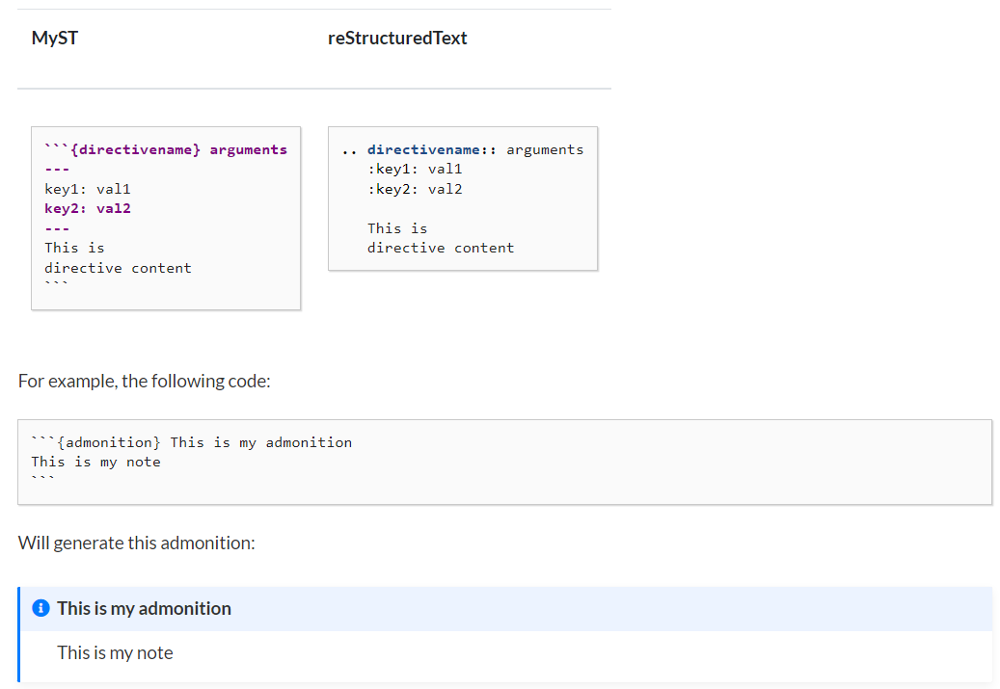
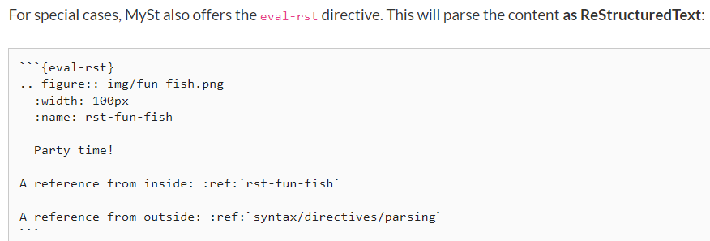

```{eval-rst}
.. _markdown-test:
```

# This is written in Markdown

```{topic} Overview

This page is generated from a Markdown file via [MyST Parser](https://myst-parser.readthedocs.io/en/latest/) and also contains raw RST for extra functionality (i.e., Markdown suffices, and RST is not necessary). To view the source code for this page, click the "Edit on GitHub" button at the top right.
```

```{contents}
---
depth: 3
---
```

## Basic Markdown formatting

*Italics*

**Bold**

***Italics and bold***

* bulleted
* list

1. numbered
2. list

[Hyperlink](https://www.google.com)

|This|is|a|table|
|:--:|:-:|:-:|:-:|
|0|1||3|

[Referencing the below Image heading](#image)

The above link generates a warning but works fine.

## Code

`inline code`

### Multiline code with syntax highlighting

```py
import os
for i in range(5):
    os.system("echo echo")
```

The language is specified as `py`.

## Image

Below should be an image that comes from a local file.


This image is from the web.


## Inline RST

Below is an example of inline RST, specifically the `see-also` directive.

```{seealso}
Hello world
```

If you scroll to the very top, the overview and contents were both generated via raw RST. This uses the `myst-parser` extension. This is how to inline RST code in a Markdown file.



[Source](https://myst-parser.readthedocs.io/en/v0.13.3/using/syntax.html#directives-a-block-level-extension-point)

The page linked above mentions that for special cases, you should use the `eval-rst` directive instead.



For example, the source for this page uses an RST directive on the first line.

Remember to add your page to `index.rst` (including the `.md` extension), and run `make html` to build the HTML.

